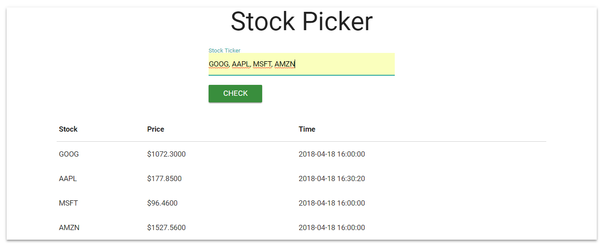

# Compartive Stocks
===================

Comparitive Stocks is a simple web application which can take in one or multiple stock ticker abbreviations through the form and pass them into an API query which will return a table of data relevant to the stocks entered.

Simple entry field.

User enters comma seperated tickers, a table is generated to display the output. 

### How I built it

1.  The first thing I did was create a project folder, created my server.js and index.ejs pages though the command line and installed the node modules I knew I would need. These included express, path, ejs, and body-parser. I used ejs because it uses javascript and runs a templating engine which simplifies and speeds up the process. I could have used angular instead of ejs but I decided not to to make the application light. 
2.  Next I set up server.js as an express platform, typical boiler plate for an express project. Importing the modules I downloaded and setting up the listen, use and set functions along with the routing. 
3.  After finishing with the set up I created the form in my index file and the '/' route to load my index page and a post route for my form to send its data to.
4.  Next I created a way to clean the post data in my server.js file. I did this by getting rid of any commas and splitting strings on spaces. Then I pushed the new sub-strings to a new array. 
5.  Next I loop through that new array and make sure each string is two to four characters, because if they're not they won't be tickers and there is no point in sending them to the API. 
6.  After I've cleaned the data I'll concatenate every remaining string with injected commas between them into one string which I'll pass into my API call. The documentation says that I can pass a string with multiple values seperated by commas so that is what I'll do. 
7.  Now I run the API call, interpolating the string we've created. 
8.  The API call returns a json, I want to assign that json to a variable. I've scoped this variable to be global to the server file, so when the client hits my '/' get function it will grab that object and pass it as context to the index page on load. 
9.  In my index file I grab that context object and make sure its truthy. If this is the first page load it will be falsey and I don't want to crash the page. Then, if it is truthy, it will trigger a loop where I'll look through every object in the array, I make sure it is an array by looking at the json the API returned in my console and determining what the array is called inside that object. 
10. Now I create a table with the headers "Stock", "Price", and "Time". I can loop through the stock array, populating each row from each object in the array. I left volume off, even though its a category the json returns because all of the stocks I entered had empty data fields in the json file, there was only a --.
11. Finally, I added materialize to make the page neat and attractive, a few simple class names makes the app go a long way. 